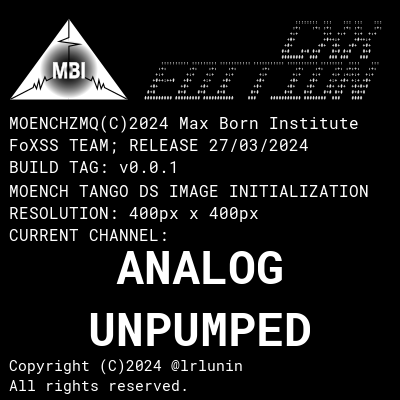

# tango-moench

[](https://github.com/lrlunin/tango-moench/actions/workflows/build-and-test.yml)
[](https://codecov.io/gh/lrlunin/tango-moench)

Tango device servers both for control and online evaluation of the acquired images.

This implementation also allows both separation and simultaneous processing with different algorithms.

| | |
|-|-| 
|  |  | 

# Dependecies installation

## Common libraries

### Ubuntu

`sudo apt install build-essential cmake libzmq3-dev rapidjson-dev libfmt-dev libhdf5-dev libboost-dev`

### CentOS/RedHat

`sudo yum install cmake gcc-c++ zeromq-devel rapidjson-devel fmt-devel hdf5-devel boost-devel`

## Tango

### Ubuntu

Follow the [original manual](https://gitlab.com/tango-controls/cppTango/-/blob/main/INSTALL.md) for Ubuntu. There is only option to build it from source.

#### Install omniORB

Download the omniORB minimal version 4.3.2 from the [sourceforge](https://sourceforge.net/projects/omniorb/files/omniORB/omniORB-4.3.2/omniORB-4.3.2.tar.bz2/download).

Unpack and install:

```bash
tar xjvf omniORB.tar.bz2 && cd omniORB-4.3.2
./configure
make -j 
sudo make install
```

#### Install tango-idl

Checkout the source repository and install:

```bash
git clone --depth 1 --branch 6.0.2 https://gitlab.com/tango-controls/tango-idl.git
cd tango-idl
cmake -B build
cmake --build build -j
sudo cmake --install build
```

#### Install cppTango

Checkout the source repository and install:

```bash
git clone --recurse-submodules --depth 1 --branch 9.5.0 https://gitlab.com/tango-controls/cppTango.git
cd cppTango
cmake -B build -DBUILD_TESTING=OFF -DTANGO_USE_JPEG=OFF -DTANGO_USE_TELEMETRY=OFF -DCMAKE_BUILD_TYPE=Release
cmake --build build -j
sudo cmake --install build
```

### CentOS/RedHat

Follow the [original manual](https://tango-controls.readthedocs.io/en/latest/installation/tango-on-linux.html#centos) for CentOS. You can either install a pre-built package from [MAX-IV repository](http://pubrepo.maxiv.lu.se/rpm/el9/x86_64/) or build it from source as well.

## slsDetectorPackage

Install the [required dependencies](https://slsdetectorgroup.github.io/devdoc/dependencies.html) of slsDetectorPackage libraries and build the package from [sources](https://github.com/slsdetectorgroup/slsDetectorPackage):

```bash
# clone the library
git clone https://github.com/slsdetectorgroup/slsDetectorPackage.git
cd slsDetectorGroup
# checkout the desired library version
git checkout tags/8.0.1
# create build folder
# maybe you can also set -DSLS_USE_DETECTOR=OFF and -DSLS_USE_RECEIVER=OFF if somehow you have to save space
cmake -B build -DSLS_DEVEL_HEADERS=ON -DSLS_USE_MOENCH=ON
# build the library
cmake --build build
# install the library (requires write access to /usr/lib etc)
sudo cmake --install build -j
```

## CUDA (optional)

Follow the [original manual](https://docs.nvidia.com/cuda/cuda-installation-guide-linux/index.html#package-manager-installation) for your platform.

# Package installation

```bash
git clone https://github.com/lrlunin/tango-moench.git
cd tango-moench
# configure the build files, enable tests or coverage if you wish
cmake -B build -DTESTS_ENABLED=OFF -DCOVERAGE_ENABLED=OFF
# build the library
cmake --build build -j
# install the library (requires write access to /usr/lib etc)
sudo cmake --install build
```

# Help

Any additional information according to slsDetector, its python API or pytango references can be found under the links:

* [slsDetectorGroup wiki](https://slsdetectorgroup.github.io/devdoc/pydetector.html)
* [Tango Controls C++ reference](https://tango-controls.readthedocs.io/en/latest/getting-started/development/cpp/index.html)

# Contributor's guide

Feel free to fork and enhance this software. Send pull requests if you want. 

1. Install `clang-format` for united source files formatting.
2. Install `gcovr` for coverage reports.
3. Install `pre-commit` for automated formatting and preview generation.
4. Run once `pre-commit install` to activate.
5. Run tests by `cd build && ctest` command.
6. Check coverage by `cd build && make coverage` command.

# Authors

Contributors names and contact info

[@lrlunin](https://github.com/lrlunin)
